# THREAD-RAG


### Traversal-Heuristic Retrieval for Embedded And Distributed Retrieval-Augmented Generation

---

# Overview

THREAD-RAG is a retrieval architecture for long-document and procedural reasoning. Instead of treating documents as bags of isolated chunks, it models them as ordered semantic threads. You jump to a relevant section using vector search, then walk through the document sequentially to reconstruct the context and reasoning path around it.

A ready-to-run evaluation harness lives in the `FREEZE/` folder. Point it at your corpus and it benchmarks all retrieval strategies across your chosen models automatically.

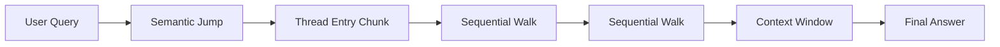

---

# The Problem with Standard RAG

Standard RAG splits documents into chunks and retrieves the most similar ones. For self-contained facts, this works. For procedural documents, step-by-step guides, legal contracts, or anything where meaning is built across sections, it regularly fails.

The retrieval is often correct in the narrow sense: the right chunk comes back. But a chunk describing step 6 of a twelve-step procedure, stripped of its surroundings, is ambiguous. Does step 5 need to complete first? Does step 7 depend on something step 6 produces? Standard RAG has no mechanism to answer these questions without returning more chunks, which may or may not land in the top-k.

```
Traditional RAG:  query → top-k chunks → answer
THREAD-RAG:       query → semantic jump → thread entry → sequential traversal → answer
```

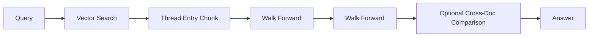

---

# Document Representation

Every document is converted into an ordered chain of chunks:

```
DOC1_000
DOC1_001
DOC1_002
DOC1_003
```

Each chunk carries a `chunk_id`, its `chunk_content`, and its `doc_id`. The sequential ID scheme means neighbor IDs compute by string arithmetic with no additional database queries:

```python
# Chunk: DOC3_012
prev_id = f'DOC3_{str(12-1).zfill(3)}'  # => 'DOC3_011'
next_id = f'DOC3_{str(12+1).zfill(3)}'  # => 'DOC3_013'
```

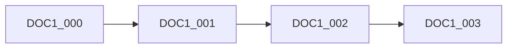

---

# Context Window

The core mechanism. Every retrieved chunk is presented inside a three-part window:

```
PREVIOUS SECTION SUMMARY
ACTIVE CONTENT
FOLLOWING SECTION SUMMARY
```

Real example:

```
--- CONTEXT WINDOW: DOC1_006 ---

PREVIOUS SECTION SUMMARY
"Step 5: Wine reduction complete; liquid reduced by half, slightly tart."

ACTIVE CONTENT
"Step 6: Taste the reduction. If it tastes sharp or acidic, add a small
pinch of sugar and stir for 30 seconds before proceeding. The goal is
a balanced sweet-acid profile."

FOLLOWING SECTION SUMMARY
"Step 7 expects a balanced flavour; sauce will be plated and garnished."

--- END WINDOW ---
```

The model now knows what step 5 produced, what step 6 is correcting for, and what step 7 expects. Without this, standard RAG returns step 6 in isolation and the model cannot answer correctly.

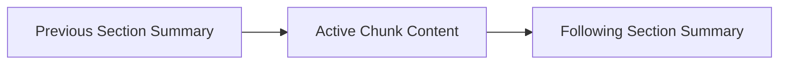

---

# Why Context Stitching Matters

Chunking cuts information at arbitrary boundaries. A retrieved chunk from the middle of a procedure has no indication of where it sits in the document's argument. THREAD-RAG reconstructs that position by attaching one-sentence summaries of neighboring sections, generated once by a lightweight 0.5B model and cached permanently.

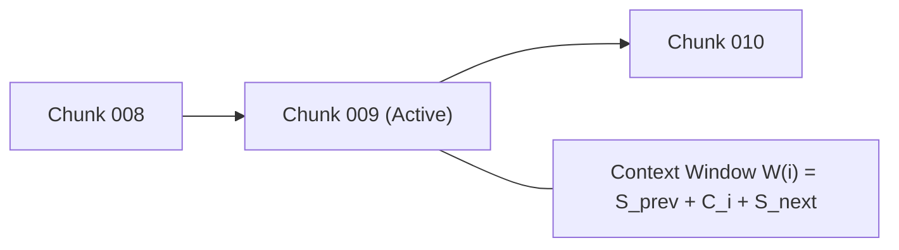

At query time, context window assembly is two dictionary lookups and one string concatenation. The 0.5B summary model runs at 40-80ms versus 1,000-1,800ms for a 20B main model. Cache misses add under 15% total latency at worst.

---

# Retrieval Architecture

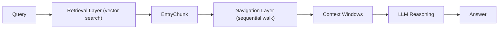

THREAD-RAG separates retrieval from navigation explicitly.

**Retrieval layer** locates relevant entry points using vector search on raw chunk text only.

**Navigation layer** explores document structure by walking forward or backward along the thread.

This separation is what prevents top-k poisoning.

---

## Jump Retrieval

```
query → vector search → starting chunk
```

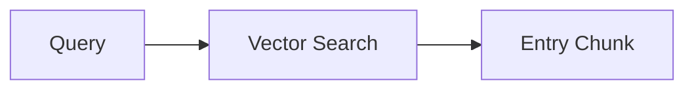

---

## Sequential Traversal

```
chunk_i → chunk_(i+1) → chunk_(i+2)
```

The agent walks forward when the following-section summary indicates the topic continues. It stops or jumps when the summary signals a topic shift.

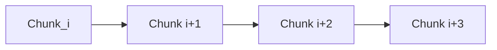

---

# Avoiding Top-K Poisoning

Embedding neighbor summaries directly into chunk vectors seems useful but is actively harmful. Adjacent chunks share near-identical summary text. Their vectors cluster together. Semantic search then returns five consecutive chunks from the same paragraph, wasting retrieval budget and missing diverse passages elsewhere in your corpus.

THREAD-RAG embeds only raw chunk text. Summaries stay in a JSON cache, fetched after retrieval, never indexed.

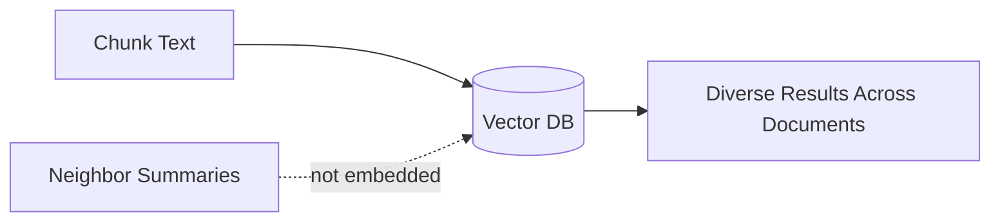

---

# Hybrid Retrieval Pattern

THREAD-RAG naturally supports jump-walk combinations within a single query:

```
jump → walk → walk → jump → walk → answer
```

Typical tool call sequence:

```python
list_available_documents()
rag_search("configure environment")          # JUMP: find entry point
fetch_chunks_by_id(["DOC1_011"])             # WALK: summary says topic continues
fetch_chunks_by_id(["DOC1_012"])             # WALK: still on-topic
rag_search("verify dependency tree")         # JUMP: new aspect of query
fetch_chunks_by_id(["DOC2_004"])             # WALK: into second document
```

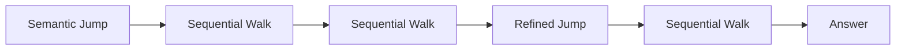

---

# Document Catalog

THREAD-RAG indexes documents with Serial IDs and chunk counts so the agent can discover and scope searches:

```
DOC1: installation guide     (47 chunks)
DOC2: grading policy         (23 chunks)
DOC3: thesis regulations     (61 chunks)
```

Searches can filter by `doc_id` to stay within a single document, or span the full corpus.

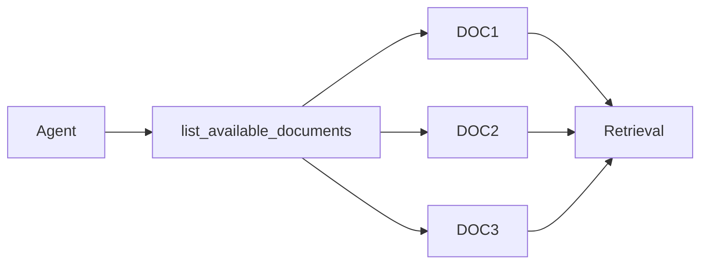

---

# Multi-Document Traversal

The same jump-and-walk pattern works across documents. The agent can read sequential context from DOC1 and DOC2 independently, then compare both assembled context windows.

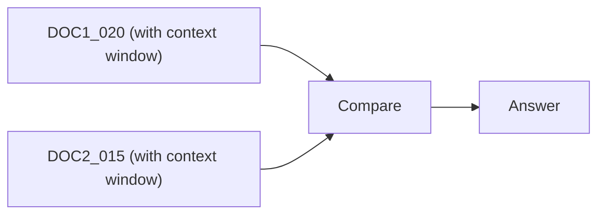

This is the pattern for cross-document consistency checks: two versions of a manual, a regulation and its implementation guide, two specs referencing the same component.

---

# Offline Summary Pre-Heating

THREAD-RAG pre-computes chunk summaries using a 0.5B model during ingestion and caches them permanently. Three modes:

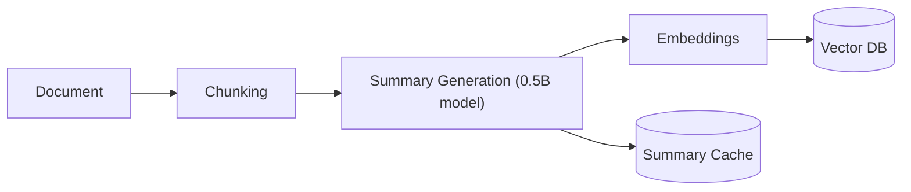

**Lazy (default):** Summaries generate on first retrieval and cache permanently. Cost paid once per chunk across the system's lifetime.

**Pre-heat:** `pre_heat_summaries()` generates all missing summaries before queries arrive. About 12 seconds for a 200-chunk document. After this, every context window assembly is two dictionary lookups at zero LLM cost.

**Batch API mode:** Pre-heat combined with a cloud LLM API. Structural token savings come from sending ~1,200 tokens per query (active content + two 50-token summaries) instead of ~3,000 tokens of raw top-k chunks. Measured reduction: around 50% in total token consumption.

---

# Thread Traversal Signals

The agent decides whether to keep walking, stop, or jump to another location based on the context window's neighbor summaries:

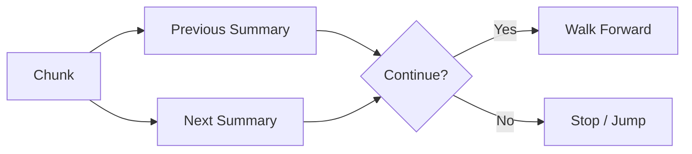

---

# Agent Workflow

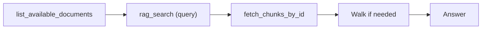

Full tool reference:

| Tool | Signature | Role |
|---|---|---|
| `list_available_documents` | `()` | Discover indexed documents and Serial IDs. Always call first. |
| `index_new_document` | `(file_path: str)` | Ingest PDF, DOCX, or TXT. Assigns DOCn Serial ID, chunks, embeds. |
| `rag_search` | `(query: str, doc_id?: str)` | Jump: vector search with optional per-document filter. |
| `fetch_chunks_by_id` | `(chunk_ids: List[str])` | Walk: fetch specific chunks and wrap in context windows. |
| `pre_heat_summaries` | `(serial_id?: str)` | Pre-generate all summaries before batch queries. |

---

# System Capabilities

THREAD-RAG supports:

* Sequential procedural document reading
* Policy and version comparison
* Long-range dependency tracing
* Narrative and argument reasoning
* Cross-document consistency checking

---

# Comparison With Other RAG Approaches

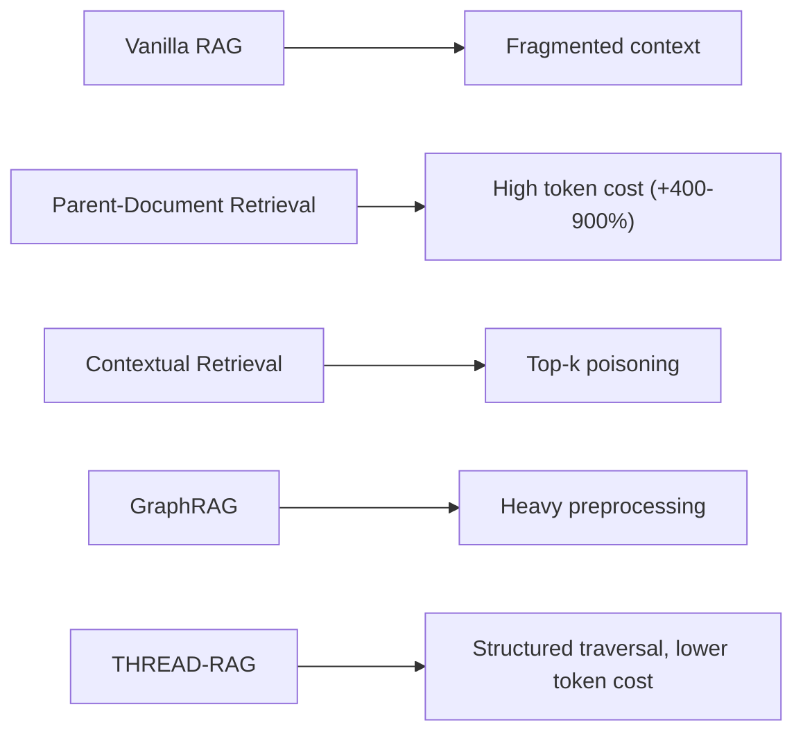

| Approach | Context method | Token cost | Sequential support |
|---|---|---|---|
| Standard RAG | None | Baseline | None |
| Sliding window | Overlapping raw text | +100-200% | Partial |
| Parent-document | Full parent section | +400-900% | None |
| GraphRAG | Entity graph traversal | +50-200% | Via graph edges |
| **THREAD-RAG** | Compressed neighbor summaries | **-12% measured** | **Native** |

---

# Ideal Use Cases

* Technical installation guides and manuals
* Legal documents and contracts
* Academic papers and research reports
* Compliance policies with cross-references
* Procedural documentation and runbooks
* Cross-version document auditing

---

# Full System Architecture

## Ingestion Pipeline (Offline)

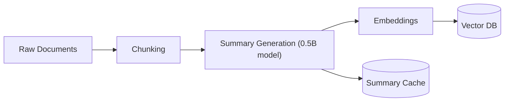

## Query and Traversal Pipeline (Runtime)

```mermaid
flowchart LR
UserQuery --> Agent
Agent --> Catalog["list_available_documents"]
Catalog --> Search["rag_search"]
Search --> VectorDB[("Vector DB")]
VectorDB --> EntryChunk
EntryChunk --> Fetch["fetch_chunks_by_id"]
Fetch --> Traverse["Sequential Walk"]
Traverse --> ContextWindows["Context Windows"]
ContextWindows --> Reasoning["LLM Reasoning"]
Reasoning --> FinalAnswer
```

---

# Conceptual Model

```
Document → Chunk Thread → Semantic Entry Point → Thread Traversal → Answer
```

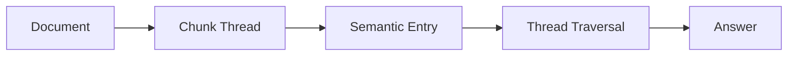

---

# Evaluation Results

Across 960 trials (four retrieval strategies, four model sizes, two embedding models), THREAD-RAG achieves a mean F1 improvement of 7.44% over standard RAG. On complex procedural queries, the Answer Correctness Rate (F1 >= 0.70) improves from 58.3% to 70.8%, a 21.4% relative gain. The wrong answer rate (F1 < 0.60) falls from 19.6% to 11.2%. The 20B model reaches 100% correctness on complex queries under THREAD-RAG. Token consumption drops by 12.4% per query on average, rising to ~50% in batch mode with pre-heating.

Full results and per-model breakdowns are in the paper included in this repository.
